# Cryptools

[Link to Cryptools Website Here](https://riyadhkh4n.github.io/cryptools/index.html)

Cryptools is a website focused to enhance the knowledge of people who want to learn and get involved with crypto and the blockchain insdustry. It is an informative website where they can learn 'What the Importance of Crypto is' and why they should care about it. As well as learn the basic fundamntals of centralisation vs. decentralisation and the important role crypto is playing in giving the power back to the people.

Cryptools also covers the basics of the two ways cryptos are generated i.e Proof of Stake and Proof of Work and the top coins within each category. Furthermore users are able to learn to value of Tokenomics which is a way to differentiate good coins and which coins to avoid. Finally, users are able to get their foot in the door by reading the 'Where to Buy' section whcih will give them all the valuable informaiton they need when making that important first step.  

---
Image from AmIResponisve goes here


# Contents
<ul>
    <li>
        <a href="#user Experience (UX)"><strong>User Experience (UX)</strong></a>               
    </li>
    <li>
        <a href="#design"><strong>Design</strong></a>
    </li>
    <li>
        <a href="#features"><strong>Features</strong></a>   
    </li>
    <li>
        <a href="#technologies"><strong>Technologies</strong></a>
    </li>
    <li>
        <a href="#testing"><strong>Testing</strong></a>
    </li>
    <li>
       <a href="#deployment"><strong>Depolyment</strong></a> 
    </li>
    <li>
       <a href="#credits"><strong>Credits</strong></a> 
    </li>
</ul>
---

# User Experience (UX) ~


* ## User Stories
    * #### First Time Visitor Goals:
        1. As a First Time Visitor, I want to be able to easily understand the intention of the website and to leave with knowledge about cryptocurencies.

        2. As a First Time Visitor, I was to ensure I can easily navigate through the webiste and ensure all links direct me to the correct section of the website.

        3. As a First Time Visitor, I want ensure no linked videos play without my discretion and all navigation links open in a new tab.

    * #### Returing Visitor Goals:
        1. As a Returning Visitor, I want to find information about cryptocurrencies to be accurate and up-to-date. 

        2. As a Returning Visitor, I want to find any links to crypto influencers who can aid my learning developmenet.

    * #### Frequent User Goals:
        1. As a Frequent User, I want to check to see if there have been any new updates added to the website, that can inhance my knowledge.

        2. As a Frequent User, I want to see if any new links have been added so that I can stay up - to -date with crypto analysits. 
    
* ## Design ~

    * Colour Scheme:

        - The three main colours for Cryptools are #542D9E which is a purple, #F9F871 which is a yellow and #F04573 which is a redish-pink. This colour palette was generated for me by using ColorSpace and selecting their generic gradient, of course black and white are prominent colours in the website aswell and are used interchangeably. Throughout the website I tried to use the 60/30/10 rule for my colour palette, this means one colour will take up 60% of the section, one 30% and the last 10%. I tried to stay as consistent as possible however depending on the sections the main colour changes in order to break up the text. There are also times where I mixed two colours together to form a gradient background. For the footer, in order for it to easily stand out I used #D3D3D3 which is a light grey.

    * Typography:

        - The 'Space Mono' font is the main font used throughout the whole website with Sans Serif as the fallback font in case for any reason the font isn't being imported into the site correctly or the web browser not being able to support the Google Font. 'Shrikhand' is used for the logo and is a clean and modern font, so it is both attractive and appropriate. Finally 'Work Sans' is used for headings. 

    * Imagery:

        - Imagery is important, it makes the webpage more aesthetic and helps break up the sections by not having too much text on one page, which may dissatisfy users. The hero image is designed to be striking and catch the user's attention. It is also relevant to the website and helps make the inital user experience to be more positive. Throughout the website, there will be embedded YouTube videos which help break up the text and allows the users to access further information on the particular section.

    * Icons:
        - I decided to use the Font Awesome icons. The icons that I chose fit in well with the overall theme of cryptocurrencies. The icons are styled in accordance with my website, with the same colors and font size.

* ## Scope ~

    * When creating Cryptools I will take an agile approach when developing. That is, creating sections of the website at a time and ensuring they work as intended before going onto the next section. I will be able to break up development by choosing small elements to work on daily, ensuring the website can be built and published in a timely fashion and ensuring I dont succumb to 'scope creep'. 

* ## Structure ~

    * I have chosen to create a website with multiple pages allowing me to separate the information into logical sections to make it easier for the user to find what they are looking for. The navigation bar at the top of all of the pages allows the user to easily navigate to the section or page of the website they are interested in.

    * On the 'index.html page', I have chosen to have a hero image with an animation (the same as the Love Running animation). This will hopefully grab the users attention instantly and intrigue them. The "Intro to Crypto" section comes next and I felt this was the proper placing for this information. Logically, the user will want to know what crypto is and why it is important before they can delve further into the topic, they will be taught the basic concept of crypto as well as how Bitcoin and Ethereum were created. The user is then guided to the 'Core Principles' section which will give them a thorough understanding of the difference between centralised and decentralised networks and how crypto solves the issues faced. After this, the next section is 'PoW vs PoS' which dives into the more technicalities of how coins / tokens are generated and put into cirulation. Although more complex it is a fundamental idea that users must grasp in order to gain a better understanding on cryptocurrencies. 

    * On the 'tokenomics.html' page, users will be given a brief overview of what tokenomics are, how they work and why they are important to understand. Without this key understanding it is very hard to know what crypto projects are legitimate and which ones are there purley for monetary gain (or scams). There will also be a linked video which will provide users with a more in - depth and complex understading of tokenomics if they wish to further expand their knowledge.

    * Finally, on the 'HowToBuy.html' page users will be given a comprehensive guide of where to buy cryptos from, either DEXs or CEXs. They will learn the difference between the two as well as the advantages and disadvantages of either. Finally they will be given a list of top exchanages which they can purchase from and will now be equipped with all the knowledge they need to begin their crypto career. 

* ## Wireframes

    * I made some basic wireframes using Balsamiq at the beginning of the project, this allowed me to get a brief understadning of how I want Cryptools to look as well as ensuring I have a rough model to follow. As a total beginner, I found Balsamiq very helpful and easy to use. I didn't quite know what styling I wanted on my pages however I had a clear picture about the content. I knew how many pages I wanted my website to have and how the sections should link to one another. Balsamiq allowed me to create a visual of my idea and gave me a goal to work towards, below my wireframes.

    * ### Home Page Wireframe 

    


    * ### Tokenomics Page Wireframe

    

    * ### Where to Buy Page Wireframe

    


# Features ~

Here describes the main features of the website and what the user can expect when viewing ~
## Existing Features:

* Navigation Bar
    - Features on all pages, the fully responsive navigation bar includes links to the Home Page, Why Should you Care section, the Centralised vs. Decentraslied section and the Tokenomics and Where to Buy pages.

    - This section will allow the user to easily navigate from page to page across all devices without having to revert back to the previous bage via the 'back' button.

        

* The landing page image
    - The landing page includes a photograph with text overlay to improve aesthetic appearance of the page and to not bombard the user with text as soon as they land on the page. 

    - This section introduces the user to ______ with an eye catching animation to grab their attention

      

* Intro To Crypto Section
    - This section is the first part of the webpage the user will see. It provides an overview of what crypto is, the main usecases as well as why the technology is important.
    - It introduces the user to the topic and will give them a basic understanding of what the purpose of crypto is and the power it can play
    
      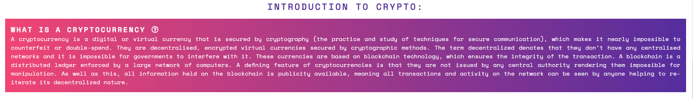
      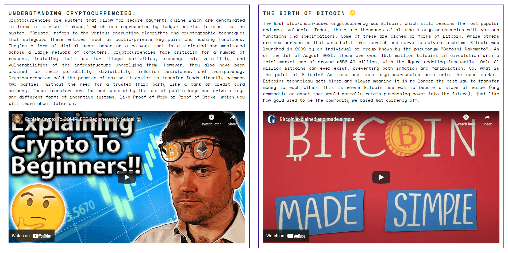
      

* Centralisation vs. Decentralisation Section
    - This part of the website will help solidify their basic understadning with giving them a brief overview and comparision between the two i.e C vs. D. Getting a strong grasp of this concept is important as this is the whole foundation on what crypto and blockchain is founded on.

      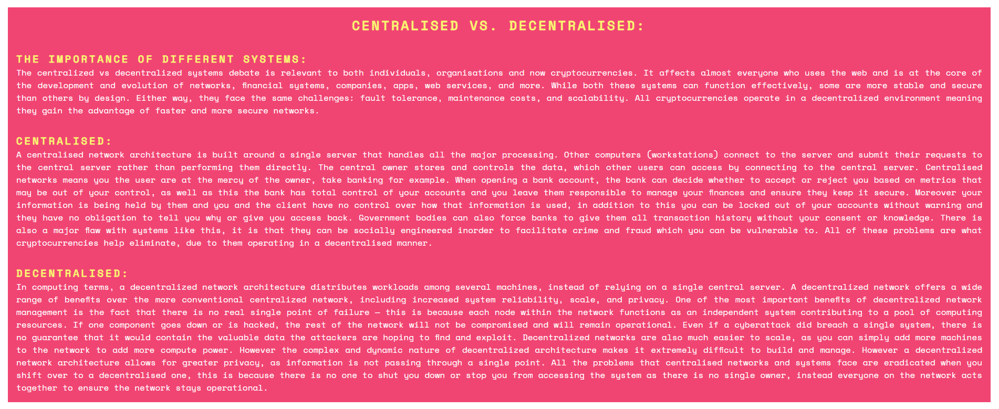

* Proof of Stake vs. Proof of Work Section
    - Getting a grasp of these two concepts is also important as it is only way cryptocurrencies are formed / mined and put into circulation for purchase.
    - Understadning the difference between the two allows the user to be aware of how the price of the coin will fluctuate and gives an insight into potential price action (PA) as halvings and buring occur

    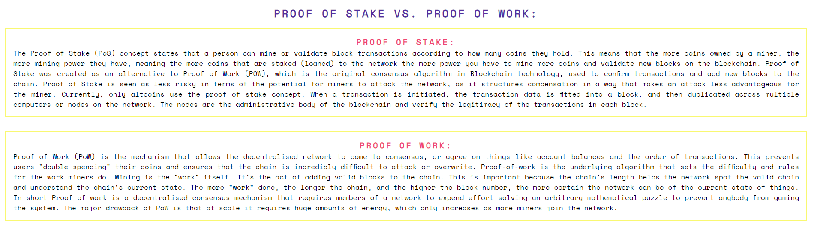
    

* Tokenomics Page
    - Tokenomics is the collection of metrics determining the quality and supply of an asset
    - This page will give the user a basic understanding of the complex world of tokenomics and the importance of being able to differentiate between good and bad tokenomics which will allow you to make better investment decisions in the future and help avoid the chance of being involved in a rug pull or scam

    
    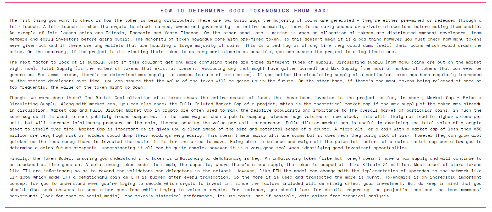
    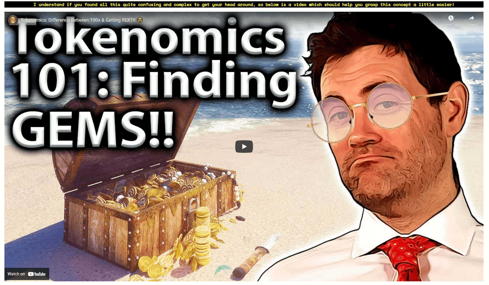

* Where to Buy Page
    - There are many places to buy crypto now and chosing the right place can be a challenge in itself. This section of the webiste will give users a comprehensive guide of how and where to buy cryptos as well as important aspects like security and the advantages and disadvanatges of certain exchanges
    - Furthermore this page will compare the difference between Decentralised Exchanges (DEXs) and Centralised Exchanges (CEXs) and give the top exchanges for each


    *INCLUDE IMAGE OF THE PAGE HERE*

## Features Left to Implement:

# Technologies ~

## Languages Used

- [HTML5](https://en.wikipedia.org/wiki/HTML5)
- [CSS3](https://en.wikipedia.org/wiki/CSS)
- [JavaScript](https://en.wikipedia.org/wiki/JavaScript)

## Frameworks, Libraries & Programs Used:

1. Hover.css:
    * Hover.css was used on the navigation bar to help identify to the user what section they are about to select

2. [Google Fonts](https://fonts.google.com/):
    * Google fonts were used to import the 'Shrikhand', 'Work Sans' and 'Space Mono' font into the style.css file which is used on all pages throughout the project.

3. [Font Awesome](https://fontawesome.com/):
    * Font Awesome was used on all pages throughout the website to add icons for aesthetic and UX purposes.

4. [Git](https://git-scm.com/):
    * Git was used for version control by utilizing the Gitpod terminal to commit to Git and Push to GitHub.

5. [GitHub](https://github.com/):
    * GitHub is used to store the projects code after being pushed from Git. It was also used to deploy the project (GitHub Pages)

6. [Flexbox](https://css-tricks.com/snippets/css/a-guide-to-flexbox/):
    * Flexbox was used to help with the layout and responsivness of the webpage

7. [Balsamiq](https://balsamiq.com/):
    * Balsamiq was used to create the wireframes during the design process.


# Testing ~

The W3C Markup Validator and W3C CSS Validator Services were used to validate every page of the project to ensure there were no syntax errors in the project.

- [W3C Markup Validator](https://validator.w3.org/#validate_by_input)
    * [index.html](documents/testing/w3cComp1.png)
    * [tokenomics.html](documents/testing/token123Comp.png)
    * [howTobuy.html](documents/testing/h2bComp.png)

- [W3C CSS Validator](https://jigsaw.w3.org/css-validator/) - [Results](documents/testing/cssComp.png)

## Website Testing (Solving Issues):
---
Upon inspection of the colour contrast on the website I am aware of a contrasting issue within the Centralised vs. Decentralised section of the website. When using Chrome Dev Tools over the paragraph elements within this section - which have the colour #FFF applied, the contrast score (under accessibility) gives a value of 3.61 along with a warning, which highlights that there may be a potential issue for people with colour blindness.

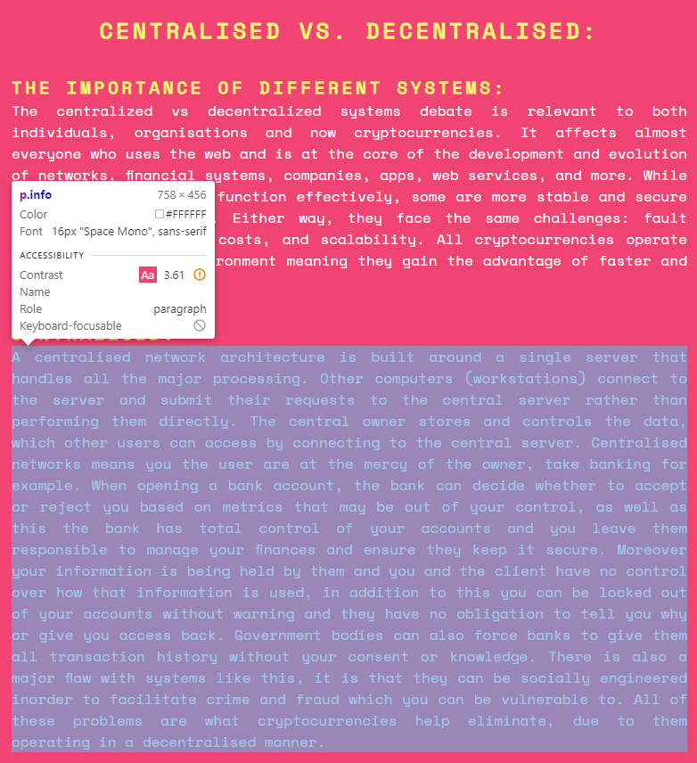

I am aware that the ideal score for Contrast is '5' and above and that there should not be a warning sign present and instead a green tick however after some inspection I noticed that the titles in the Centralised vs. Decentralised section, which all have the colour #F9F871 applied to it - which is a yellow - gave a Contrast score of 3.22 and a green tick which is less than the paragraph elements and would actually be harder to see against the #F04573 background comapred to white.   

.png)

After changing the colour of the paragraph elements to see which would improve the score, it turned out that black actually improved the Contrast score significantly and brought it up to 5.8 and a green tick was present. Signifying that instead of white, black was actually the better colour to use when trying to improve the contrast against the pink background. 


However, due to aesthetic and personal reasons I am going to keep the text within this section to white as I believe it stands out more against the darker background, as having two dark colours (black and #F04573) would mean the text would be harder to read as the colours are too similar. Furthermore the score given did not make sense as a pass was given to an element which had a lower Contrast score compared to one with a higher score - so I am going to leave the text as white as I believe it will infact make it easier to read for people with colour blindness to read. However I made sure to comply with the scoring given to other elements throughout the rest of the website.

--- 
Another issue I came across is that my footer would not stick to the bottom of the page when there was not enough content to push it down. Although I knew each page would contain enough content to push it down to the bottom and make it stay, I wanted to find a solution that would mean it would automatically stay at the bottom regardless of the amount of content present. Below is an image of the issue I was facing:

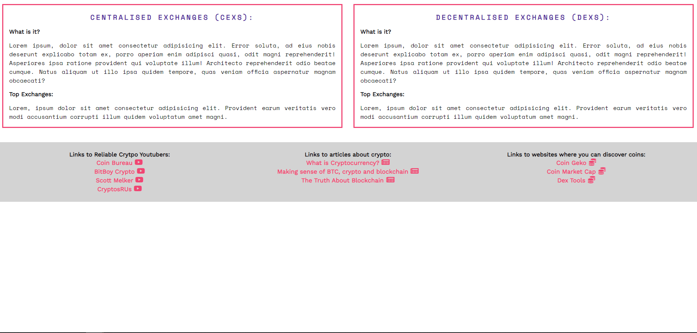

After doing some looking aorund on Slack I came across a Mentor who posted a 'Dev Tip' that would allow the footer to stay at the bottom of the page no matter how much content there was. Therefore I implemented his code and was able to get my desired output.

```
body {
  min-height: 100vh;
  display: flex;
  flex-direction: column;
  margin: 0;
}   

main {
  flex-grow: 1;
}
```
Here is the new output with the ammeneded code:

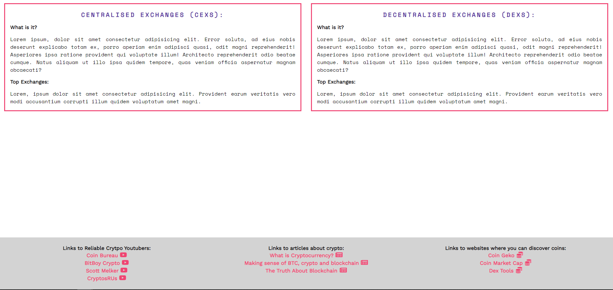

---
I am aware of an issue that arises to the hero image when the viewport width is set to 2110px and above, the image I chose has dimensions 1920 x 1280 and therefore when viewing at this screen size the hero image has white space to the left and right which makes the homepage not look as intended.

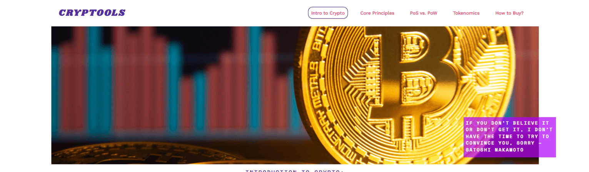

In order to make the aesthetics of the website look better when viewing at this screen size, I have added a background colour of lightgrey helping to break up the empty white space and allowing the nav bar and hero image to be visually separated. In addition to this, the cover text hangs over the image into the empty space which is not what I want so I have changed its positioning when viewing at this size so it is aligned more to the right. The new output can be viewed below:

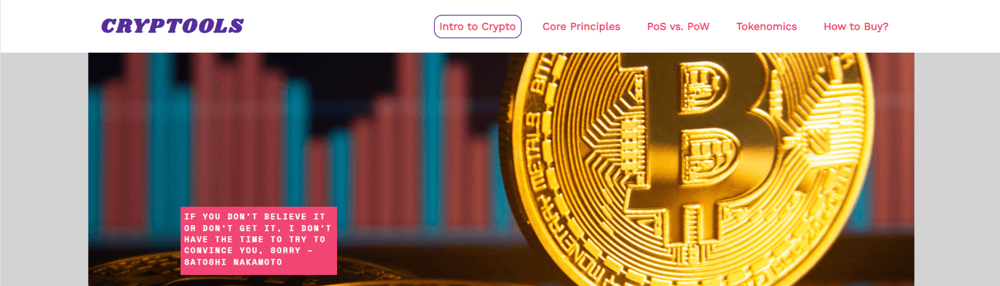

Another issue with the hero image arises when viewing on mobile, this is because the image I chose is fairly large so when vieiwng on a small screen most of the image is cut out which makes the webiste look odd as you only see 1/4 of the image making the landing page look odd.


In order to get around this I decided to use a smaller image when the user is viewing the webiste on mobile that would fit better. This image makes the website look alot cleaner and overall it will improve user engagement. The updated hero image for mobile is below:

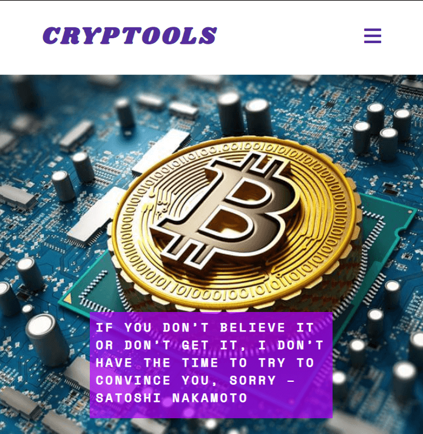

---

## Testing User Stories from User Experience (UX) Section

* ### First Time Visitor Goals:

* ### Returning Visitor Goals:

* ### Frequent User Goals:


# Deployment ~

## GitHub Pages

The project was deployed to GitHub Pages using the following steps...

1. Log in to GitHub and locate the GitHub Repository

2. At the top of the Repository (not top of page), locate the "Settings" Button on the menu.
    
3. Scroll down the Settings page until you locate the "GitHub Pages" Section.
    Under "Source", click the dropdown called "None" and select "Master Branch".
   
4. The page will automatically refresh.
    
5. Scroll back down through the page to locate the now published site link in the "GitHub Pages" section.

## Forking the GitHub Repository

By forking the GitHub Repository we make a copy of the original repository on our GitHub account to view and/or make changes without affecting the original repository by using the following steps...

1. Log in to GitHub and locate the GitHub Repository
2. At the top of the Repository (not top of page) just above the "Settings" Button on the menu, locate the "Fork" Button.
3. You should now have a copy of the original repository in your GitHub account.


## Making a Local Clone

1. Log in to GitHub and locate the GitHub Repository
2. Under the repository name, click "Clone or download".
3. To clone the repository using HTTPS, under "Clone with HTTPS", copy the link.
4. Open Git Bash
5. Change the current working directory to the location where you want the cloned directory to be made.
6. Type git clone, and then paste the URL you copied in Step 3.

    $ `git clone https://github.com/RiyadhKh4n/cryptools.git` 

7. Press Enter. Your local clone will be created. 

```
$ git clone https://github.com/RiyadhKh4n/cryptools.git
> Cloning into `CI-Clone`...
> remote: Counting objects: 10, done.
> remote: Compressing objects: 100% (8/8), done.
> remove: Total 10 (delta 1), reused 10 (delta 1)
> Unpacking objects: 100% (10/10), done.
```

# Credits ~

## Content:
* All information on the website was taken from different souces as well as a large marjority being my own - Links to all sources are below:

## Media

### Images
* The Hero Image used on the home page was taken from the webiste linked [here](https://cdn.zmescience.com/) - [Link to Image Here](https://cdn.zmescience.com/wp-content/uploads/2021/04/bitcoin-trading-volume.jpg)

* The Hero Image used for the mobile version of the site was taken from the website linked [here](https://www.forbes.com/?sh=faa6e492254c) - [Link to Image Here](https://thumbor.forbes.com/thumbor/960x0/https%3A%2F%2Fspecials-images.forbesimg.com%2Fimageserve%2F5ff76b9b66ab78e35db03812%2FA-picture-of-bitcoin--a-cryptocurrency--on-a-motherboard-%2F960x0.jpg%3Ffit%3Dscale)

## Website Information (Content):
* [Investopedia](https://www.investopedia.com/terms/c/cryptocurrency.asp)
* [Payoda](https://www.payoda.com/introduction-to-the-concepts-of-cryptocurrency/)
* [TechTalks](https://bdtechtalks.com/2017/10/27/why-does-the-centralized-internet-suck/)
* [N-Able](https://www.n-able.com/blog/centralized-vs-decentralized-network)
* [Intego](https://www.intego.com/mac-security-blog/cryptocurrency-101-part-1-blockchain-and-basic-concepts/)
* [Berty](https://berty.tech/blog/decentralized-distributed-centralized)
* [Nasdaq](https://www.nasdaq.com/articles/decentralized-and-centralized-exchanges%3A-who-will-win-the-race-2020-11-05)
* [DevProvider](https://www.devprovider.com/centralised-vs-decentralised-exchanges/)
* [Binance Academy](https://academy.binance.com/en/articles/what-is-a-decentralized-exchange-dex#how-a-centralized-exchange-works)
* [IDEX](https://blog.idex.io/all-posts/the-pros-and-cons-of-centralized-exchanges-decentralized-exchanges-and-hybrid-exchanges)


## Source of YouTube Videos in Website:
* [Coin Bureau](https://www.youtube.com/c/CoinBureau)
* [The Guardian](https://www.youtube.com/guardian)
* [Simply Explained](https://www.youtube.com/c/Savjee)

## Code
When developing the website I spent alot of time breaking down how I would code each section and what I needed to implement to ensure it looked and worked how I wanted it to. Therefore the vast majority of the code is orginal and my own however there were times where I did need help in progressing and when this happened I went on [slack](https://slack.com/intl/en-gb/) to ask fellow students if they knew how to help. If this did not work I would use [StackOverflow](https://stackoverflow.com/) which more often then not allowed me to get to the bottom of my problem and progress in developing Cryptools. I was also inspired by the Love Running project and used what I learnt from there as guide when I got stuck, as this demo project taught me alot and was a good foundation when developing this project.

The only code in the webiste that was copied from a third - party was the burger menu and collapsible buttons. I implemented the burger menu on the back of my meeting with my tutor as they suggested it would be the easiest way to solve the issue I was having, as my nav bar takes up alot of space due to the length of the items and making it responsive for mobile would have be an issue. Therefore, I used [this](https://www.w3schools.com/howto/howto_js_topnav_responsive.asp) w3School lesson as well as a [YouTube video](https://www.youtube.com/watch?v=ydZc17rlR5E&list=PLt9gBsKEdOaxKmcaKgRGVkKurX84uhF3r&index=9) in order to successfully implement the burger menu. When developing Cryptools, I realised that my homepage was very text heavy which would cause users to have a negative experience as too much text is very overwhelming, thus I wanted to add a collapsible button which the user can select if they wanted to know more about a particular section. Why not just remove some of the text? Although this would have made my problem easier I wanted to keep the information as I believe it is important and valuable to know if you want to learn more about cryptocurrencies and removing is would sacrafice this. As a result I did some research and found out how to implement this feature using [this](https://www.w3schools.com/howto/howto_js_collapsible.asp) w3schools tutorial as well as help from YouTube.
 
---
