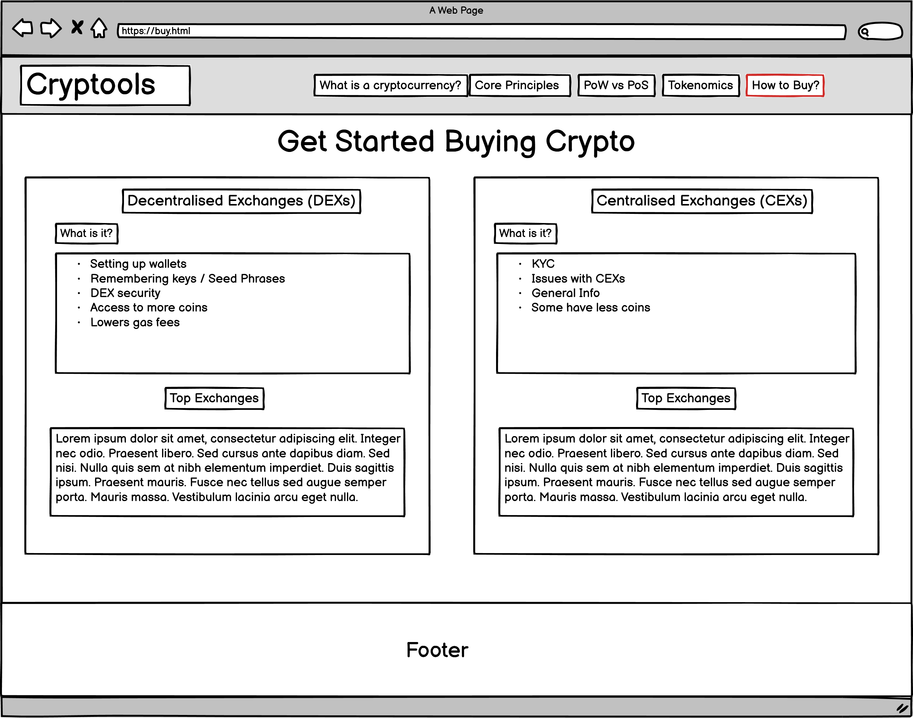

# Cryptools

[](View the live project here)

Cryptools is a website focused to enhance the knowledge of people who want to learn and get involved with crypto and the blockchain insdustry. It is an informative website where they can learn 'What the Importance of Crypto is' and why they should care about it. As well as learn the basic fundamntals of centralisation vs. decentralisation and the important role crypto is playing in giving the power back to the people.

Cryptools also covers the basics of the two ways cryptos are generated i.e Proof of Stake and Proof of Work and the top coins within each category. Furthermore users are able to learn to value of Tokenomics which is a way to differentiate good coins and which coins to avoid. Finally, users are able to get their foot in the door by reading the 'Where to Buy' section whcih will give them all the valuable informaiton they need when making that important first step.  

---
Image from AmIResponisve goes here

---
# User Experience (UX) ~


* ## User Stories
    * #### First Time Visitor Goals:
        1. As a First Time Visitor, I want to be able to easily understand the intention of the website and to leave with knowledge about cryptocurencies.

        2. As a First Time Visitor, I was to ensure I can easily navigate through the webiste and ensure all links direct me to the correct section of the website.

        3. As a First Time Visitor, I want ensure no linked videos play without my discretion and all navigation links open in a new tab.

    * #### Returing Visitor Goals:
        1. As a Returning Visitor, I want to find information about cryptocurrencies to be accurate and up-to-date. 

        2. As a Returning Visitor, I want to find any links to crypto influencers who can aid my learning developmenet.

    * #### Frequent User Goals:
        1. As a Frequent User, I want to check to see if there have been any new updates added to the website, that can inhance my knowledge.

        2. As a Frequent User, I want to see if any new links have been added so that I can stay up - to -date with crypto analysits. 
    
* ## Design ~

    * Colour Scheme:

        - The two main colours for Cryptools are purple and black. They are clean contrasting colours that pop. 

    * Typography:

        - The 'Space Mono' font is the main font used throughout the whole website with Sans Serif as the fallback font in case for any reason the font isn't being imported into the site correctly or the web browser not being able to support the Google Font. 'Shrikhand' is used for the logo and is a clean and modern font, so it is both attractive and appropriate. Finally 'Work Sans' is used for headings. 

    * Imagery:

        - Imagery is important, it makes the webpage more aesthetic and helps break up the sections by not having too much text on one page, which may dissatisfy users. The hero image is designed to be striking and catch the user's attention. It is also relevant to the website and helps make the inital user experience to be more positive.

    * Icons:
        - I decided to use the Font Awesome icons. The icons that I chose fit in well with the overall theme of cryptocurrencies. The icons are styled in accordance with my website, with the same colors and font size.

* ## Scope ~

    * When creating Cryptools I will take an agile approach when developing. That is, creating sections of the website at a time and ensuring they work as intended before going onto the next section. I will be able to break up development by choosing small elements to work on daily, ensuring the website can be built and published in a timely fashion and ensuring I dont succumb to 'scope creep'. 

* ## Structure ~

    * I have chosen to create a website with multiple pages allowing me to separate the information into logical sections to make it easier for the user to find what they are looking for. The navigation bar at the top of all of the pages allows the user to easily navigate to the section or page of the website they are interested in.

    * On the 'index.html page', I have chosen to have a hero image with an animation (the same as the Love Running animation). This will hopefully grab the users attention instantly and intrigue them. The "Intro to Crypto" section comes next and I felt this was the proper placing for this information. Logically, the user will want to know what crypto is and why it is important before they can delve further into the topic, they will be taught the basic concept of crypto as well as how Bitcoin and Ethereum were created. The user is then guided to the 'Core Principles' section which will give them a thorough understanding of the difference between centralised and decentralised networks and how crypto solves the issues faced. After this, the next section is 'PoW vs PoS' which dives into the more technicalities of how coins / tokens are generated and put into cirulation. Although more complex it is a fundamental idea that users must grasp in order to gain a better understanding on cryptocurrencies. 

    * On the 'tokenomics.html' page, users will be given a brief overview of what tokenomics are, how they work and why they are important to understand. Without this key understanding it is very hard to know what crypto projects are legitimate and which ones are there purley for monetary gain (or scams). There will also be a linked video which will provide users with a more in - depth and complex understading of tokenomics if they wish to further expand their knowledge.

    * Finally, on the 'HowToBuy.html' page users will be given a comprehensive guide of where to buy cryptos from, either DEXs or CEXs. They will learn the difference between the two as well as the advantages and disadvantages of either. Finally they will be given a list of top exchanages which they can purchase from and will now be equipped with all the knowledge they need to begin their crypto career. 

* ## Wireframes

    * I made some basic wireframes using Balsamiq at the beginning of the project, this allowed me to get a brief understadning of how I want Cryptools to look as well as ensuring I have a rough model to follow. As a total beginner, I found Balsamiq very helpful and easy to use. I didn't quite know what styling I wanted on my pages however I had a clear picture about the content. I knew how many pages I wanted my website to have and how the sections should link to one another. Balsamiq allowed me to create a visual of my idea and gave me a goal to work towards, below my wireframes.

    * ### Home Page Wireframe 

    


    * ### Tokenomics Page Wireframe

    

    * ### Where to Buy Page Wireframe

    


# Features ~

Here describes the main features of the website and what the user can expect when viewing ~
## Existing Features:

* Navigation Bar
    - Features on all pages, the fully responsive navigation bar includes links to the Home Page, Why Should you Care section, the Centralised vs. Decentraslied section and the Tokenomics and Where to Buy pages.

    - This section will allow the user to easily navigate from page to page across all devices without having to revert back to the previous bage via the 'back' button.

    *INCLUDE IMAGE OF NAV BAR HERE*

* The landing page image
    - The landing page includes a photograph with text overlay to improve aesthetic appearance of the page and to not bombard the user with text as soon as they land on the page. 

    - This section introduces the user to ______ with an eye catching animation to grab their attention

      *INCLUDE IMAGE OF HERO IMAGE HERE*

* Why Should You Care Section
    - This section is the first part of the webpage the user will see. It provides an overview of what crypto is, the main usecases as well as why the technology is important.
    - It introduces the user to the topic and will give them a basic understanding of what the purpose of crypto is and the power it can play
    
      *INCLUDE IMAGE OF THE SECTION HERE*

* Centralisation vs. Decentralisation Section
    - This part of the website will help solidify their basic understadning with giving them a brief overview and comparision between the two i.e C vs. D. Getting a strong grasp of this concept is important as this is the whole foundation on what crypto and blockchain is founded on.

    *INCLUDE IMAGE OF THE SECTION HERE*

* Proof of Stake vs. Proof of Work Section
    - Getting a grasp of these two concepts is also important as it is only way cryptocurrencies are formed / mined and put into circulation for purchase.
    - Understadning the difference between the two allows the user to be aware of how the price of the coin will fluctuate and gives an insight into potential price action (PA) as halvings and buring occur

    *INCLUDE IMAGE OF THE SECTION HERE*

* Tokenomics Page
    - Tokenomics is the collection of metrics determining the quality and supply of an asset
    - This page will give the user a basic understanding of the complex world of tokenomics and the importance of being able to differentiate between good and bad tokenomics which will allow you to make better investment decisions in the future and help avoid the chance of being involved in a rug pull or scam

    *INCLUDE IMAGE OF THE PAGE HERE*

* Where to Buy Page
    - There are many places to buy crypto now and chosing the right place can be a challenge in itself. This section of the webiste will give users a comprehensive guide of how and where to buy cryptos as well as important aspects like security and the advantages and disadvanatges of certain exchanges
    - Furthermore this page will compare the difference between Decentralised Exchanges (DEXs) and Centralised Exchanges (CEXs) and give the top exchanges for each


    *INCLUDE IMAGE OF THE PAGE HERE*

## Features Left to Implement:

# Technologies Used ~

## Languages Used

- HTML5 <--- Add link to HTML5 wiki 
- CSS3 <--- Add Link to CSS3 Wiki

## Frameworks, Libraries & Programs Used:

1. Hover.css:
    * Hover.css was used on the navigation bar to help identify to the user what section they are about to select

2. Google Fonts:
    * Google fonts were used to import the 'Shrikhand', 'Work Sans' and 'Space Mono' font into the style.css file which is used on all pages throughout the project.

3. Font Awesome:
    * Font Awesome was used on all pages throughout the website to add icons for aesthetic and UX purposes.

4. Git:
    * Git was used for version control by utilizing the Gitpod terminal to commit to Git and Push to GitHub.

5. GitHub:
    * GitHub is used to store the projects code after being pushed from Git. It was also used to deploy the project (GitHub Pages)

6. Flexbox:
    * Flexbox was used to help with the layout and responsivness of the webpage

7. Balsamiq:
    * Balsamiq was used to create the wireframes during the design process.


# Testing ~

The W3C Markup Validator and W3C CSS Validator Services were used to validate every page of the project to ensure there were no syntax errors in the project.

- W3C Markup Validator - Results
- W3C CSS Validator - Results

## Testing User Stories from User Experience (UX) Section

* ### First Time Visitor Goals:

* ### Returning Visitor Goals:

* ### Frequent User Goals:


# Depolyment ~

## GitHub Pages

The project was deployed to GitHub Pages using the following steps...

1. Log in to GitHub and locate the GitHub Repository

2. At the top of the Repository (not top of page), locate the "Settings" Button on the menu.
    
3. Scroll down the Settings page until you locate the "GitHub Pages" Section.
    Under "Source", click the dropdown called "None" and select "Master Branch".
   
4. The page will automatically refresh.
    
5. Scroll back down through the page to locate the now published site link in the "GitHub Pages" section.

## Forking the GitHub Repository

By forking the GitHub Repository we make a copy of the original repository on our GitHub account to view and/or make changes without affecting the original repository by using the following steps...

1. Log in to GitHub and locate the GitHub Repository
2. At the top of the Repository (not top of page) just above the "Settings" Button on the menu, locate the "Fork" Button.
3. You should now have a copy of the original repository in your GitHub account.


## Making a Local Clone

1. Log in to GitHub and locate the GitHub Repository
2. Under the repository name, click "Clone or download".
3. To clone the repository using HTTPS, under "Clone with HTTPS", copy the link.
4. Open Git Bash
5. Change the current working directory to the location where you want the cloned directory to be made.
6. Type git clone, and then paste the URL you copied in Step 3.

    $ `git clone https://github.com/RiyadhKh4n/cryptools.git` 

7. Press Enter. Your local clone will be created. 

```
$ git clone https://github.com/RiyadhKh4n/cryptools.git
> Cloning into `CI-Clone`...
> remote: Counting objects: 10, done.
> remote: Compressing objects: 100% (8/8), done.
> remove: Total 10 (delta 1), reused 10 (delta 1)
> Unpacking objects: 100% (10/10), done.
```

# Credits ~

## Content


## Media
* The photos used on the home page are from This (include link) Open Source site

## Code

---
